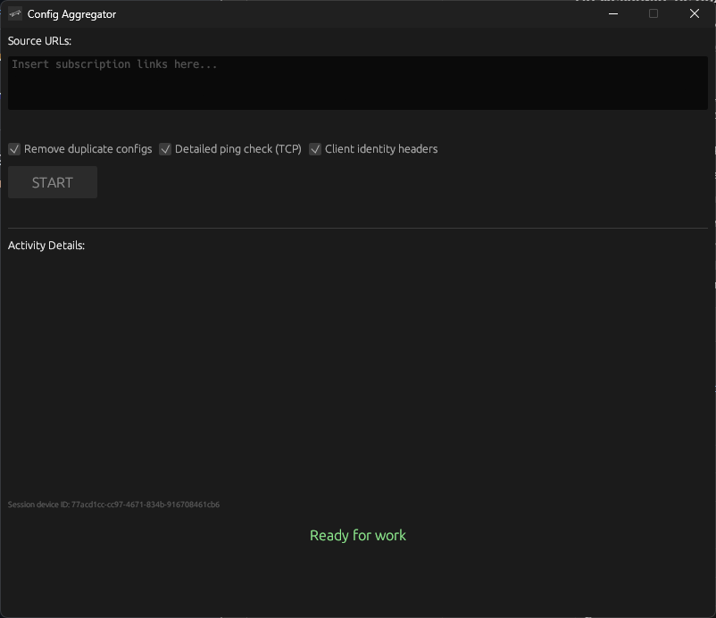

# Subscription Config Aggregator & TCP Health Checker

[](LICENSE)

[](https://github.com/renkagod/vpn-aggregator/actions/workflows/ci.yml)

Rust desktop utility that pulls remote subscription feeds, merges proxy-style config lines, deduplicates them, and optionally filters by TCP reachability. Built with **egui/eframe**, **reqwest**, and **tokio**.

## Screenshot



## What it does

- **Subscription fetching** — HTTP(S) download with base64/plain-text decoding.
- **URI parsing** — Extract host/port from common proxy URI schemes (VLESS, VMess, SS, Trojan, SSR).
- **Deduplication** — Merge multiple sources into one unique list.
- **TCP health checks** — Parallel connectivity probes with per-endpoint latency.
- **Desktop GUI** — Dark-themed **egui** interface; writes merged output next to the binary.

## Stack

| Layer | Choice |
|-------|--------|
| Language | Rust 2021 |
| UI | egui / eframe |
| HTTP | reqwest (blocking) |
| Async I/O | tokio (`TcpStream`, timeouts) |
| Packaging | Single release binary (Windows resource icon via `winres`) |

## Usage

1. Paste subscription or config URLs (one per line) into the source field.
2. Enable **Remove duplicate configs** and/or **Detailed ping check (TCP)** as needed.
3. Click **START** — output is base64-encoded and saved as `subscription.txt` beside the executable.

## Build

```powershell
cargo build --release
```

Release artifact: `target/release/vpn-aggregator` (`.exe` on Windows).

## License

[MIT](LICENSE) — Copyright (c) 2026 [renkagod](https://github.com/renkagod).
